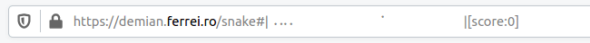

# URL Snake

Play the classic snake game on a URL!

This is how the game should look:

Note that the game might be unplayable on some browsers for different reasons, like the browser not showing the full URL, or not allowing it to change so frequently, or escaping the Braille characters used to display the game.

## How to Play

- Use arrow keys or WASD to control the snake
- On touch devices, use the on-screen arrow buttons
- The snake moves on the browser's URL bar
- Eat food to grow longer and increase your score
- Avoid hitting walls or yourself

## Installation

Simply open `index.html` in your web browser to play!

Bug reports, ideas and pull requests are always [welcome](https://github.com/ishantoz/snake-url/issues)!

